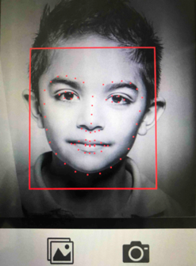
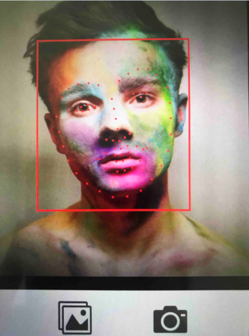
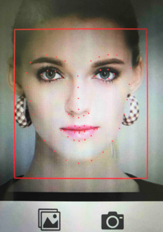

# MobileNet_facial_landmarks
1、本项目是关于人脸关键点定位在移动端的demo实现，是18-19年初的一些工作说明；  
2、主要方法是基于mobilenet-ssd的模型修改的结构，用于人脸68关键点的定位工作；  
3、demo中依赖一些训练的模型权重，具体可从网盘下载：  
```
链接: https://pan.baidu.com/s/1o-v_fE-kBiv7JGhBuIUSNw?pwd=2ah5 提取码: 2ah5
```
4、原始基于DCNN实现的人脸关键点定位在移动端(华为畅享8)的推理时间大概是600ms；具体的模型实现可参考之前的项目；  
<https://github.com/JWSunny/Face_Landmarks/tree/master/DCNN>  
5、主要在华为畅享8上进行测试，在无任何移动端推理框架优化的情况下，推理时间300ms；  
6、下面主要是一些结果展示：  



